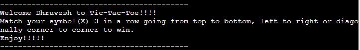
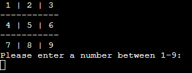
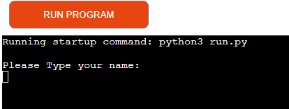
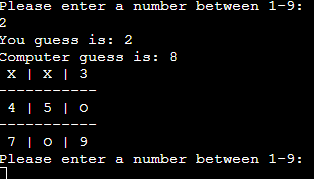
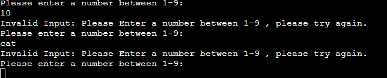
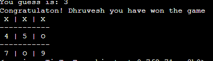

# Tic-Tac-Toe

Tic-Tac-Toe is a Python terminal game, which runs in Code Institute mock terminal on Heroku.

Users can try to beat the computer by matching their symbol in a row before computer match theirs.

Visit the deployed site here :[Tic-Tac-Toe game](https://tic-tac-toe-games-dc7531f170f5.herokuapp.com/)

---

## How to PLAY

---

Tic-Tac-Toe is a classic 2 player game where the goal of the match 3 of their symbol in a row.

In this version, the user will play against computer.

User will have first turn and they have to choose number that is being display on the game board.

After user computer will take it's turn by randomly choosing the other blocks display on the game board.

User goal is to make a 3 row match without computer blocking the way.

if the user make 3 row then user wins else computer wins if both failed then the game is tied.

---

## User Experience - UX

---

### Initial Discussion

#### Key information for the site

- Fun introduction to Tic-Tac-Toe.
- Display of game board.
- Display of symbols.
- choose input by typing the number.
- Alert user for win, loss and tied

---

### User Stories

---

#### Client Goals

- To be able to view play the game.
- To be able to input their choice.
- To be able to see what computer chooses.
- To be able to update the display.
- To be able to see the results.

#### First Time Visitor Goals

- I want to play a relaxing game.
- I want to see the game board and to be able to have choice on input.
- I want to be see the results at the end.

#### Returning Visitor Goals

- I want to play a relaxing game.
- I want to be able to win with different tactics.
  
#### Frequent Visitor Goals

- I want to play a relaxing game.

---

## Design

---

## Features

---

### General Features of the page

---
- Display game board
  - Player should see a Tic-Tac-Toe board with numbers between 1-9

- Play against the computer
- Input validation and error-checking

  - Accept user input

  - checks if the input is between 1-9 and an integer
  - Computer input randomly generated

  - if the space has a symbol than it will tell occupied

- Display the board with symbols as user and computer input their choice
- Tell user the result of the game at the end

- Data maintained in class instances

---

#### Future Features

---
- Player will allow to restart the game
- The turns will be random so computer can go first
- Player will be allowed to play against other players
- It will track the score of the players if players restart the game
- it will check the input of user name to prevent irrelevant names

---

## Data Model

---
I decided to use a Tic-Tac-Toe class as my model. The game create instance of Tic-Tac-Toe class to play the game.

The Tic-Tac-Toe class holds the display of the game board, the guess of user, the random choice of computer using library, checking where to put symbols using the input's, calling all the function, telling user the results at the end, details of the player's name.

## Tic-Tac-Toe - TESTING DOCUMENTATION

---

## AUTOMATED TESTING
  
### Validator testing

- [PEP8](https://pep8ci.herokuapp.com/#)
  - Passed the code using PEP8 and confirmed their are no problems

---

## Manual Testing

---
- Tested with all possible outcomes of the user input
- Given invalid Inputs: such as strings when numbers are expected and out of bound input, same input twice
- Tested in my local terminal and Gitpod terminal

### Bugs
#### Solved Bugs
- The computer input function was having a recursion error which was solved by giving it game over which makes it stop.
- The result at the end was printing twice it was solved by putting an if statement for user and computer input

#### Remaning Bugs
- No bugs remaining

## Technologies used

#### Language used

Python

#### Frameworks, Libraries & Programs Used

- Python library [random](https://docs.python.org/3/library/random.html#module-random) was used to randomly generate numbers.
- [ui.dev](https://ui.dev/amiresponsive) - To create views of the website on different viewing devices.

## Deployment

---
 - This site was deployed using the following steps:
  - Fork or clone this repository
  - Create a new Heroku app
  - set the buildbacks to Python and NodeJa in that order
  - Link the Heroku app to the repository
  - Click on deployed

### Local development

---

#### How to Fork

1. Log in to Github.
2. Go to the repository for this project.
3. At the top right of the page, click the "Fork" button. This will create a copy of the repository under your Github account.

#### How to clone

1. Log in to Github.
2. Go to the repository for this project.
3. Click on the "Code" button, select from HTTPS, SSH or Github CLI.
4. Copy the URL for the repository.
5. Open your terminal or command prompt.
6. Navigate to the directory where you want to clone your repository.
7. Use the `git clone` command followed by the URL that you have copied.
